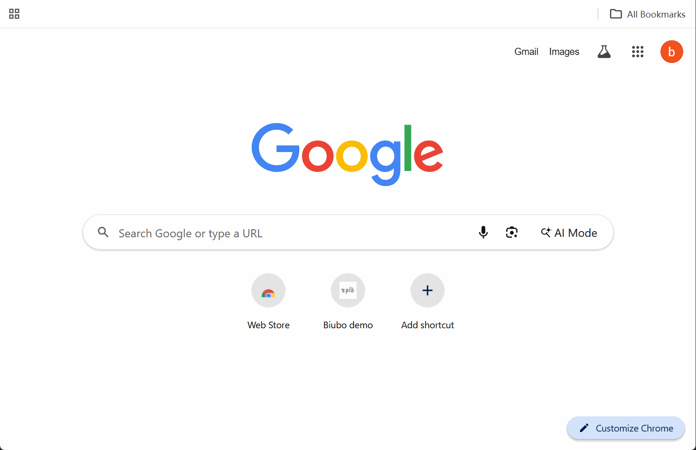
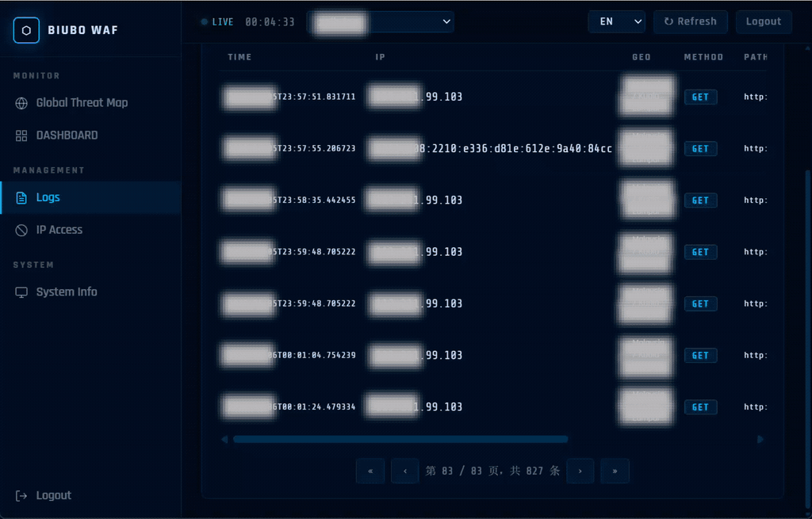
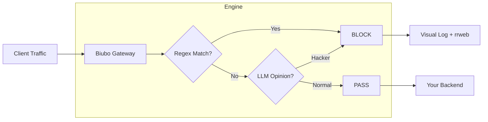

# 🛡️ Biubo WAF

<p align="center">
  
  <br>
  
  
  
  
  
  <br>
  <b>A Web Application Firewall that Thinks, Remembers, and Visualizes.</b>
</p>

---

## ⚡ What is Biubo WAF?

**Biubo WAF** 是一個智能 Web 應用程式防火牆，結合了正則表達式的高性能和 LLM 的語義理解能力。它作為您應用程式的守護者，通過雙重鏡頭監控每個請求：**正則表達式性能**和 **LLM 感知**。

**Biubo WAF** is not just another rule-based filter. It is an **Intelligence-First Proxy** that bridges the gap between high-speed security and modern AI intuition. It sits as a guardian in front of your applications, watching every request through a dual lens of **Regex Performance** and **LLM Awareness**.

> [!TIP]
> **Zero-Zero Setup**: No SQL, No Redis, No complex Nginx configs. Just Python and the power of AI.

---

## 🧠 AI Configuration & File Locations

### AI 配置文件位置

AI 相關配置存儲在以下位置：

| 配置項 | 文件位置 | 說明 |
| :--- | :--- | :--- |
| **API Key** | `config.json` | LLM API 密鑰 |
| **LLM Model** | `config.json` | 使用的 LLM 模型名稱 |
| **Base URL** | `config.json` | LLM API 基礎 URL |
| **Settings** | `src/config/settings.py` | 系統設置加載器 |

### AI 核心文件位置

| 文件 | 路徑 | 說明 |
| :--- | :--- | :--- |
| **LLM Client** | `src/services/llm/client.py` | OpenAI 兼容的 LLM 客戶端 |
| **WAF Engine** | `src/core/engine/waf_engine.py` | WAF 核心引擎（包含 AI 檢測邏輯） |
| **Rules Engine** | `src/core/engine/rules.py` | 正則表達式規則引擎 |
| **Validators** | `src/utils/validators.py` | 請求驗證器 |

### 配置示例

在 `config.json` 中配置 AI：

```json
{
    "API_KEY": "your-api-key-here",
    "LLM_MODEL": "qwen-plus",
    "LLM_BASE_URL": "https://dashscope.aliyuncs.com/compatible-mode/v1"
}
```

支持的 LLM 提供商：
- 阿里雲通義千問 (qwen-plus)
- Groq (llama-3.1-8b-instant)
- 任何 OpenAI 兼容的 API

---

## 🎬 See it in Action

### 1. 🧠 Intelligence You Can Trust
Biubo WAF monitors every packet. From complex obfuscated payloads to sudden anomalies, watch it neutralize threats in milliseconds before they even reach your server.
> ****
> *Attack detected and IP instantly isolated using high-speed signature and semantic correlation.*

### 2. 🎥 Visual Forensics (The "DVR" for Security)
Stop guessing. Watch exactly what the attacker did on your site with our integrated `rrweb` session playback.
> ****

### 🗺️ 3. Real-time Attack Visualization
Stay ahead of the threat. Visualize every incoming attack on a live global map, providing instant situational awareness.
> ****

---

## ✨ Key Features

| Feature | Description | Status |
| :--- | :--- | :--- |
| **Dual-Path Detection** | Regex (Fast Path) + LLM (Deep Path) for maximum coverage. | ✅ |
| **Visual Session Replay** | Integrated `rrweb` to record and playback malicious sessions. | ✅ |
| **JS Challenge** | Client-side Challenge-Response to stop headless bots. | ✅ |
| **Self-Contained DB** | Lightning-fast Msgpack storage with write-behind flushing. | ✅ |
| **Dynamic Dashboard** | Modern, responsive console for real-time traffic monitoring. | ✅ |

---

## 🧱 Architecture & Flow



---

## 🚀 Quick Start

### One-Step Installation
```bash
# Clone the repository
git clone https://github.com/BiuboWAF/Biubo.git
cd Biubo

# Run the interactive setup
python setup.py

# Configure AI in config.json
# Set API_KEY, LLM_MODEL, and LLM_BASE_URL

# Start protecting
python main.py
```

### Docker Deployment
```bash
docker run zplb/biubo:1.1.0
```

---

## 📑 Documentation Links

-   [**Developer Guide**](DEVELOPER.md) - How the engine works internally.
-   [**Roadmap**](ROADMAP.md) - Our vision for P1/P2/P3.
-   [**Contributing**](CONTRIBUTING.md) - We need your code and ideas!

---

## 📄 License

Biubo WAF is open-source software licensed under the **MIT License**.

<p align="center">
  Built with ❤️ for a more secure, intelligent web.
</p>
